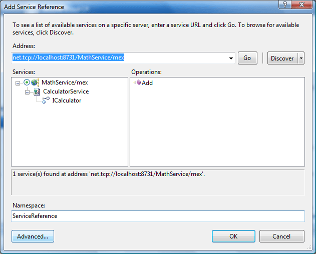
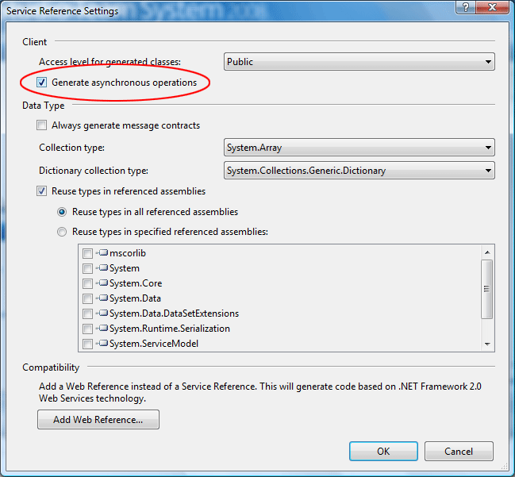

# Invoking a Service Asynchronously

## Introduction

Whenever I design a service I have the habbit of wrapping the client-side proxy in a helper class. This shields the end-user from having to deal with the proxy directly and with the clean up code.

The service references and coherent helper classes are put in a seperate class library. Such a helper class provides public methods that delegate to the protected proxy property. If more than one client application uses the service then you can just reference this code library and reuse the helper classes.

An example of this can be found in my "[A Combination of WCF Essentials](http://cgeers.wordpress.com/2008/04/12/a-combination-of-wcf-essentials/)" article. One reader asked the following question:

> _Interesting article, in particular the part about wrapping the proxy. I’m thinking of wrapping a proxy in a class library, but can’t figure out how to expose the async methods of the proxy to the users of the dll. Do You have any suggestions regarding that?_

This article focuses on accomplishing just that. So let's get started...

## The Service

Start Visual Studio and create a new blank solution named "WcfAsynchronously". Add a new project called "MathServiceLibrary" based on the WCF Service Library project template to the solution.

The service made for this article is just your basic run of the mill calculator. It exposes one single method Add(...) which as the name indicates allows you to add some numbers. Rename the IService1 code file to ICalculator and add the code shown in Listing 1.

**Listing 1** - The Service Contract

```csharp
using System;
using System.ServiceModel;

namespace CGeers.Wcf.Server.MathServiceLibrary
{
    // The Namespace property is provided for illustrative purposes
    [ServiceContract(Namespace = "cgeers.wordpress.com")]
    public interface ICalculator
    {
        [OperationContract]
        int Add(int x, int y);
    }
}
```

The service type which implements this service contract is equally simple. Rename the Service1 code file to CalculatorService. Listing 2 lists the code you need to add to this file.

**Listing 2** - The Service Type

```csharp
using System;
using System.ServiceModel;
using System.Threading;

namespace CGeers.Wcf.Server.MathServiceLibrary
{
    public class CalculatorService : ICalculator
    {
        #region ICalculator Members

        public int Add(int x, int y)
        {
            // To simulate a lengthy request.
            Thread.Sleep(3000);
            return (x + y);
        }

        #endregion
    }
}
```

Remember to replace the references to IService1 and Service1 in the App.config file with ICalculator and CalculatorService respectively. To speed things up I recommend setting the binding to TCP. Take a look at the accompagnying source of this article to see how the App.config file is setup.

That concludes setting up the demo service for this article. Go ahead and press F5 to test the service with the WCF Test client to check if everything is working correctly.

## Asynchronous Operations

Create a new Console Application named ConsoleClient and set a Service Reference to the calculator service created earlier. Do so by right-clicking on the ConsoleClient project in the Solution Explorer and choosing the Add Service Reference option from the context menu.



If you click on the above image you'll see a full-size screenshot of the Add Service Reference dialog. In the lower-left corner you'll notice a button labelled Advanced. Clicking on this button will result in a new dialog with various settings that allow you to control the way the client-side proxy will be generated.



The only option you should be aware of is the Generate asynchronous operations setting. Checking this option will make sure extra methods for the client-side proxy will be generated to allow you to call the remote methods asynchronously. Go ahead and check it. Finally click OK on both the dialog boxes to generate the proxy.

For this example I have opted not to create a separate class library for the service reference and the helper class which will be discussed shortly for this example. Separating this should be a straightforward process. Here I have not done so for simplicity's sake.

## Asynchronous Invocation Pattern

If you are familiar with asynchronous method invocation using delegates then you should feel right at home. Assume you have declared a delegate which takes two integers parameters and returns an integer. Listing 3 contains a small example putting this delegate into action.

**Listing 3** - Synchronous invocation

```csharp
using System;

namespace DelegateExample
{
    class Program
    {
        public delegate int CalculatorOperation(int x, int y);

        static void Main()
        {
            // Synchronous invocation
            CalculatorOperation sycnOperation =
                new CalculatorOperation((x, y) => { return (x + y); });

            int result = sycnOperation(3, 2);
            Console.WriteLine("The result of the synchronous invocation is {0}.\n", result);
            Console.ReadLine();
        }
    }
}
```

As you may know when you declare a new delegate type you actually declare a new sealed class type which descends from the MulticastDelegate type.

Apart from invoking a delegate synchronously as the above example shows the MulticastDelegate type also provides two methods named BeginInvoke(...) and EndInvoke(...) which allow you to invoke it asynchronously as shown in Listing 4.

**Listing 4** - Asynchronous invocation

```csharp
using System;
using System.Runtime.Remoting.Messaging;

namespace DelegateExample
{
    class Program
    {
        public delegate int CalculatorOperation(int x, int y);

        static void Main()
        {
            // Asynchronous invocation
            CalculatorOperation asyncOperation =
                new CalculatorOperation((x, y) => { return (x + y); });

            asyncOperation.BeginInvoke(3, 2, ar => { OnAdded(ar); }, null);
            Console.WriteLine("The client application is doing some other stuff.");
            Console.WriteLine("Press enter to exit when the asynchronous invocation completes.\n");
            Console.ReadLine();
        }

        private static void OnAdded(IAsyncResult itfAsyncResult)
        {
            AsyncResult asyncResult = (AsyncResult)itfAsyncResult;
            CalculatorOperation operation = (CalculatorOperation)asyncResult.AsyncDelegate;
            int result = operation.EndInvoke(itfAsyncResult);
            Console.WriteLine("The result of the asynchronous invocation is also {0}.", result);
        }
    }
}
```

The BeginInvoke(...) method first takes the parameters declared in the delegate type which in this example are two integers. The final two arguments are always an AsyncCallback delegate and the mother of all objects, namely a System.Object.

The [AsyncCallback delegate](http://msdn.microsoft.com/en-us/library/system.asynccallback.aspx) returns nothing and takes an instance of a class which implements the IAsyncResult interface.

**Listing 5** - AsyncCallback delegate

```csharp
public delegate void AsyncCallback(IAsyncResult ar)
```

The AsyncCallback delegate will be called when the asynchronous operation completes. Using the IAsyncResult parameter you can retrieve the results of the asynchronous operation.

To retrieve the result you should get hold of a reference to the original delegate that started the operation. The incoming IAsyncResult result parameter is an instance of the AsyncResult class. This class contains a property called AsyncDelegate, which actually is a reference to the delegate that started it all.

So with the proper explicit type casting you can get a hold of this delegate. All that is left to do is to call the EndInvoke(...) method on it. The EndInvoke(...) method returns the result of the operation and takes the IAsyncResult parameter as its sole argument.

There are other asynchronous invocation patterns, but for this article this one suffices. If you are keen on exploring the other types then check out [this article](http://www.ondotnet.com/pub/a/dotnet/2003/02/24/asyncdelegates.html).

This exact same asynchronous invocation pattern will be generated automatically for the client-side proxy. Before we get around to wrapping the proxy let's just pauze a second to reflect on the last argument of the BeginInvoke(...) method.

This argument allows you to pass custom state data from the primary thread to the callback method. Since this argument is of the type System.Object you can pass along any type of data. Keep this in mind as it will be used in the next section.

## Helper Class

Return to the ConsoleClient project and add a new class called Calculator. Be sure to include the service reference made earlier by adding it to the using directives. Listing 6 lists the code for this class type. Most of the code follows the asynchronous invocation pattern discussed in the previous section.

**Listing 6** - Complete Calculator Class

```csharp
using System;
using CGeers.Wcf.Client.ConsoleClient.ServiceReference;

namespace CGeers.Wcf.Client.ConsoleClient
{
    public class MathOperationEventArgs : EventArgs
    {
        public int Result { get; set; }
    }

    public class Calculator
    {
        #region Event(s)

        public event EventHandler<MathOperationEventArgs> Added;

        #endregion

        #region Asynchronous methods

        protected virtual void OnAdded(IAsyncResult asyncResult)
        {
            CalculatorClient proxy = asyncResult.AsyncState as CalculatorClient;
            if (proxy != null)
            {
                if (Added != null)
                {
                    Added(this, new MathOperationEventArgs { Result = proxy.EndAdd(asyncResult) });
                }
                proxy.Dispose();
            }
        }

        public void Add(int x, int y)
        {
            CalculatorClient proxy = new CalculatorClient();
            proxy.BeginAdd(x, y, ar => { OnAdded(ar); }, proxy);
        }

        #endregion
    }
}
```

When you call the Add(...) method on an instance of the Calculator class type it will delegate this request to an instance of the client-side proxy using its asynchronous BeginAdd(...) method. The proxy itself is passed as the last argument of this method. This way the OnAdded AsyncCallback delegate can retrieve the proxy instance and call the EndAdd(...) method on it.

As you might have guessed the BeginAdd(...) and EndAdd(...) methods correspond to the BeginInvoke(...) and EndInvoke(...) methods discussed in the previous section.

The AsycnCallback delegate retrieves the result of the asynchronous operation and fires the Added event of the Calculator type passing the result in a custom type derived from EventArgs.

In the end all the user of this class type has to do is call the Add method and subscribe to the Added event. In the next section the sample ConsoleClient application shows how this is done.

## Client Application

Most of the code for the ConsoleClient application has already been explained. All that remains is an example detailing how to use the helper class which wraps the client-side proxy for the Calculator service. So without further ado, here's the code.

**Listing 7** - Using the Calculator Helper Class

```csharp
using System;
using System.Threading;

namespace CGeers.Wcf.Client.ConsoleClient
{
    class Program
    {
        static void Main()
        {
            bool stop = false;

            Calculator calculator = new Calculator();

            // Add an event handler for the Added event using a Lambda expression.
            calculator.Added +=
                (s, e) =>
                {
                    Console.WriteLine("The result of the addition is {0}.", e.Result);
                    stop = true;
                };

            //Add 2 and 3.
            Console.WriteLine("Invoke the Add method.");
            calculator.Add(2, 3);

            while (!stop)
            {
                Console.WriteLine("The client is doing some stuff...");
                Thread.Sleep(250);
            }

            Console.ReadLine();
        }
    }
}
```

A new instance of the Calculator helper class is created. Next an event handler for its Added event is provided in the form of a Lamba expression and finally the Add(...) method is invoked.

The Add(...) method on the Calculator service pauses for 3 seconds to simulate a lengthy request. During this request the client proceeds to print out messages to the console. This is done only for illustrative purposes to indicate the asynchronous nature of the call to the Add(...) method on the helper class.

## Shortcut

The Calculator helper class provides a way to call the asynchronous BeginAdd(...) method offered by the generated client-side proxy. If you subscribe to the Added event you will receive the result of the calculation. You don't have to worry about handling the asynchronous calls yourself, the result of the calculation is extracted for you by the helper class and you receive it in an event handler of your choice.

Although it isn't much work to setup this pattern for you helper classes it might be nice if something like this came out of the box. Luckily this is the case, the generated client-side proxy already contains the necessary infrastructure for this pattern.

If you take a look at the generated code for the proxy two things should stand out. An AddAsycn(...) method and an AddCompleted event are provided. These correspond to the Add(...) method and Added event of the Calculator helper class. Listing 8 shows how you can use these.

**Listing 8** - The Shortcut

```csharp
private static void TheShortcut()
{
    CalculatorClient proxy = new CalculatorClient();
    proxy.AddCompleted +=
        (sender, e) =>
        {
            Console.WriteLine("The result of the addition is {0}.", e.Result);
        };
    proxy.AddAsync(4, 2);
}
```

**Remark**: This event based model requires .NET version 3.5. Check out [Dan Rigsby's article](http://www.danrigsby.com/blog/index.php/2008/03/18/async-operations-in-wcf-event-based-model/) for more information.

## Summary

Thanks to the Service Reference Settings dialog adding support for asynchronously invoking methods of a service is a breeze. As you have seen the generated client-side proxy provides you with a BeginXXX(...) and EndXXX(...) method for each method offered by the service.

The Calculator helper class provides a way to shield the end-user of the service from having to deal with these asynchronous methods by using a method invocation / event pattern.

Finally it was shown that the generated proxy already provides such a pattern thus greatly reducing the need for any glue code needed in the helper class.
